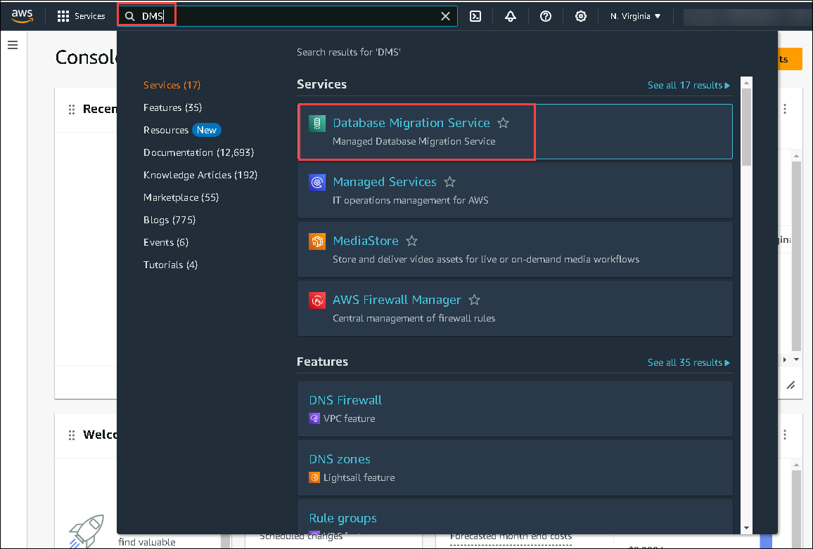
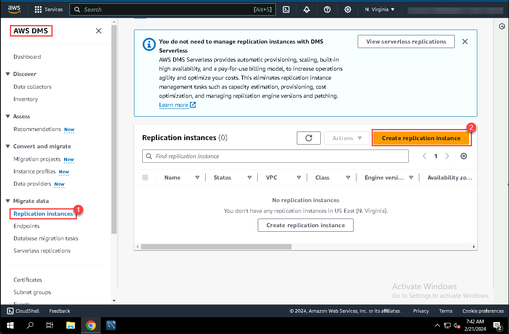
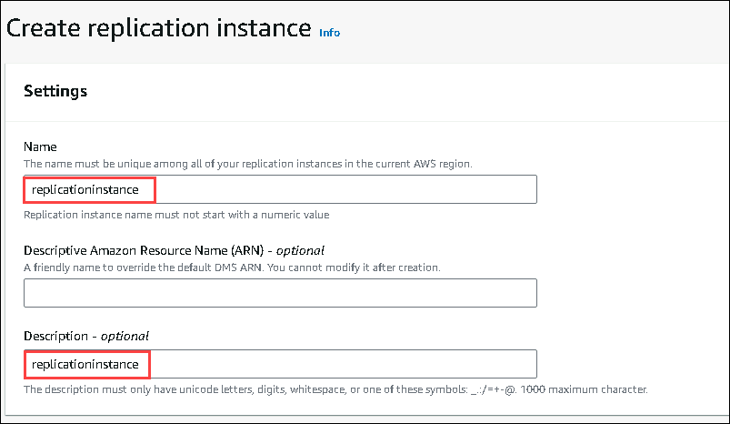
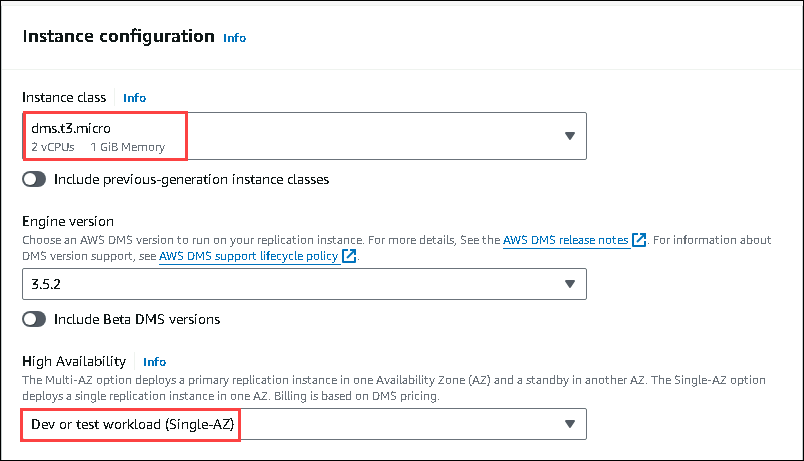
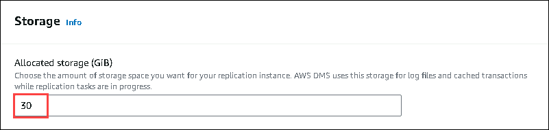
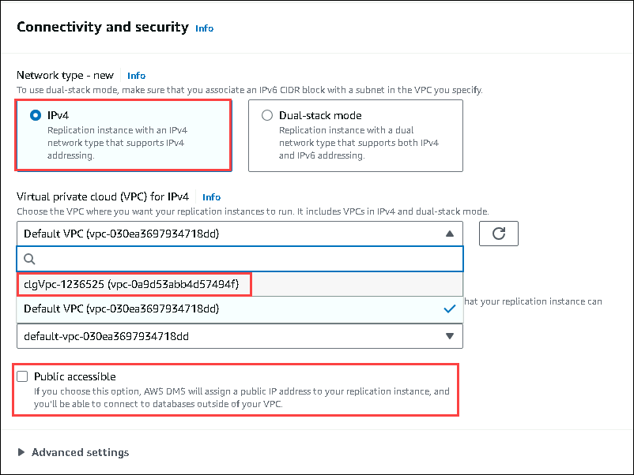
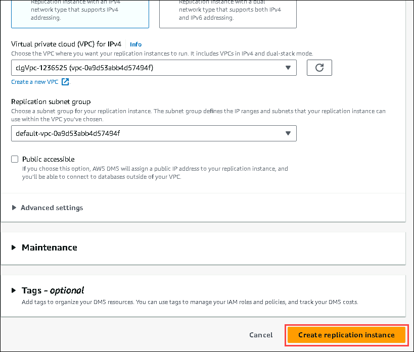

# Exercise 3: Migrate your source MySQL database to your Aurora instance using the AWS Database Migration Service

In this exercise, you will use the AWS Database Migration Service to migrate your mydb database running on your MySQL instance to your Aurora instance.

Follow the below steps to migrate your source MySQL database to your Aurora instance using the AWS Database Migration Service.

1. At the top of the AWS Management Console, in the search bar, search for the service **DMS**.

2. On the AWS DMS page, open the navigation page on the left click on the **Replication Instance (1)**, and the **Create Replication Instance (2).**

3. On the Replication Instance page, provide the below details to configure the Instance.

* For the Replication Instance Name, enter **replicationInstance.**

* For the Description, enter **replicationInstance.**

* For the Instance Class, choose **dms.t3.micro**

* For the High Availability, choose **Dev or test workload(Single-AZ).**

* For the Storage, enter **30.**

* For the Virtual private cloud (VPC) for IPv4, choose VPC name starting with **clgVpc**.

* For the Public accessible, Deselect the option.

* Click on **Create Replication Instance.**

**Note: The creation of a replication instance may take 5-10 minutes. You may have to wait for your replication instance to become active.**

