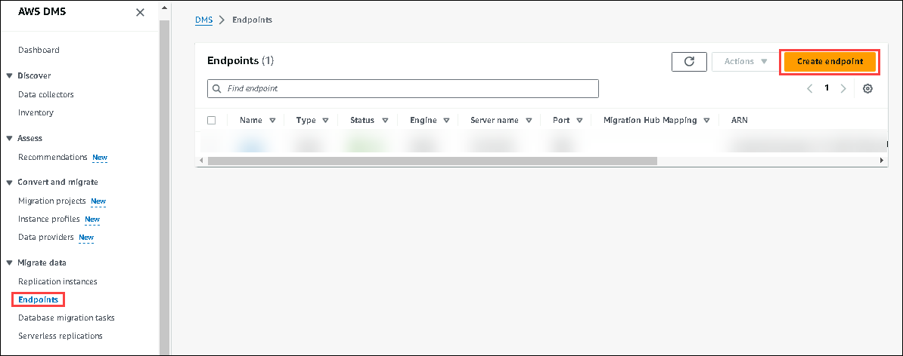
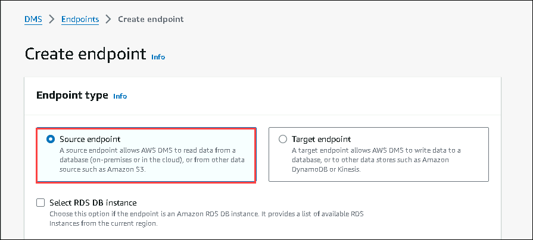
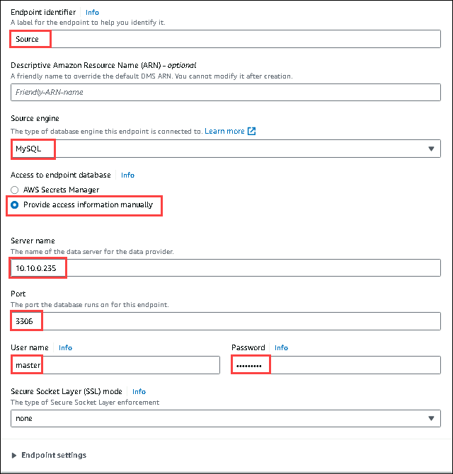
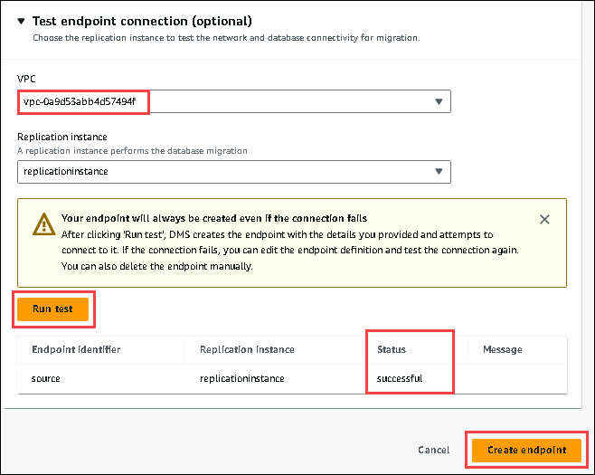

# Exercise 4: Create Your Source Endpoint

In this exercise, you will be creating a source endpoint. An endpoint provides connection, data store type, and location information about your data store. The AWS Database Migration Service uses this information to connect to a data store and migrate data from a source endpoint to a target endpoint. You can specify additional connection attributes for an endpoint by using extra connection attributes. These attributes can control logging, file size, and other parameters; for more information about extra connection attributes, see the documentation section for your data store.

Follow the below steps to configure the source endpoint:

1. On the AWS DMS page, open the navigation page on the left, click on the **Endpoints (1)**, and **Create endpoints (2).**

2. Provide the below values while configuring the endpoint.

* For the endpoint type, choose **Source endpoint.**

* For the Endpoint identifier, enter **Source.**

* For the Source engine, enter **MySQL.**

* For the Access to endpoint database, choose **Provide access information manually.**

* For the Server name, enter .

* For the Port, enter **3306**.

* For the User name, enter .

* For the Password, enter.

3. Scroll down to the Test endpoint connection:

* For the VPC, choose the VPC that contains **clgVpc** in it.

* Click on **Run Test**, and if the status is **successful,** then click on the **Create endpoint.**

