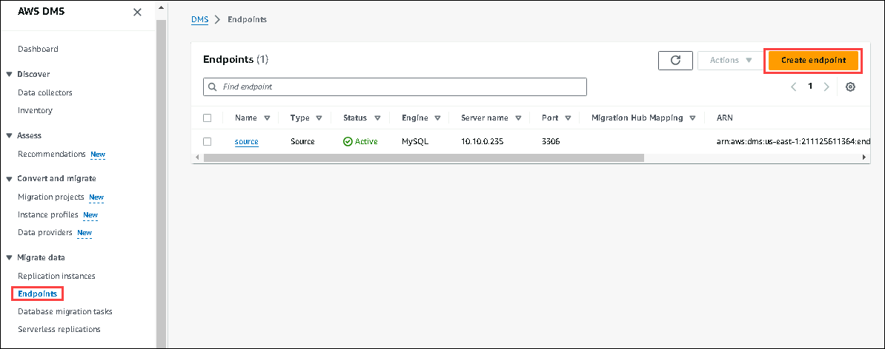
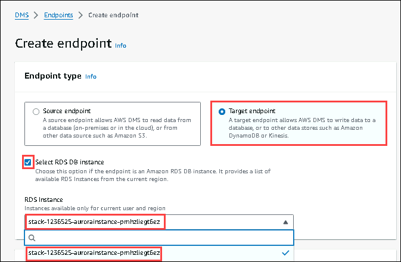
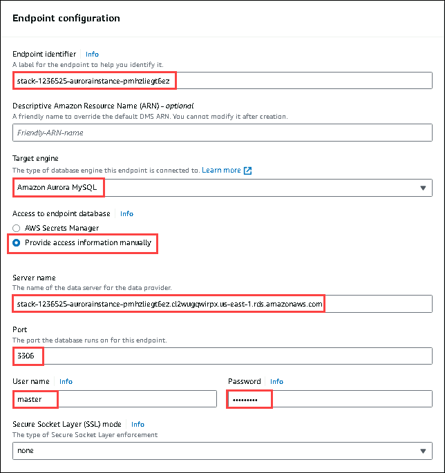
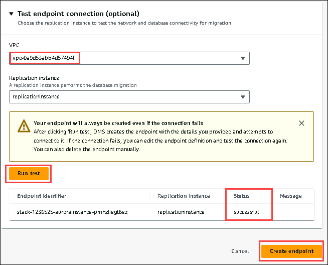

# Exercise 5: Create Your Target Endpoint.

In this exercise, you will be creating the endpoint for your **Aurora Instance.**

Follow the below steps to configure Target endpoint:

1. On the AWS DMS page, open the navigation page on the left, click on the **Endpoints (1)**, and **Create endpoints (2)**.

2. In the Create endpoint, choose the below values.

* For the endpoint type, choose **Target endpoint,** and click on **Select RDS DB instance**, and choose **Aurora Instance** from the drop down menu.

* In the Endpoint configuration, provide the below values.

* For the Endpoint identifier, select the pre-created Aurora Instance.

* In the Target engine, choose **Amazon Aurora MySQL.**

* In the Access to endpoint database, choose **Provide access information manually.**

* For the Server name, choose

* For the Port, enter **3306**

* For the User name, enter .

For the Password, enter .

4. Scroll down to the Test endpoint connection:

* For the VPC, choose the VPC whose name is like **clgVpc**.

* Click on **Run Test**, and if the status is **successful**, then click on the **Create endpoint.**

