# AWS IAM Policy Creation Lab Guide

## Table of Contents
1. [Introduction](#introduction)
2. [Prerequisites](#prerequisites)
3. [Creating an IAM Policy](#creating-an-iam-policy)
    1. [Step 1: Sign in to AWS Management Console](#step-1-sign-in-to-aws-management-console)
    2. [Step 2: Navigate to IAM](#step-2-navigate-to-iam)
    3. [Step 3: Create a New Policy](#step-3-create-a-new-policy)
    4. [Step 4: Define Permissions](#step-4-define-permissions)
    5. [Step 5: Review and Create](#step-5-review-and-create)
4. [Conclusion](#conclusion)

## Introduction
An IAM **(Identity and Access Management)** policy in AWS is a JSON document that specifies permissions for actions on AWS resources. These policies are attached to users, groups, or roles to control access, ensuring users have only the **necessary permissions**, which enhances security and simplifies management.

IAM policies are essential for **automating permission management**, ensuring compliance, and maintaining a secure AWS environment. They enable precise control over resources, such as granting read-only access or restricting specific actions, thereby reducing the risk of unauthorized access and improving operational efficiency.

This lab guide provides step-by-step instructions to create an AWS IAM policy using the AWS Management Console. IAM policies define permissions for actions on AWS resources.

## Prerequisites
- An AWS account
- Appropriate permissions to create IAM policies

## Creating an IAM Policy

### Step 1: Sign in to AWS Management Console
1. Open a web browser and go to the [AWS Management Console](https://aws.amazon.com/console/) and click on Click on "Sign in".
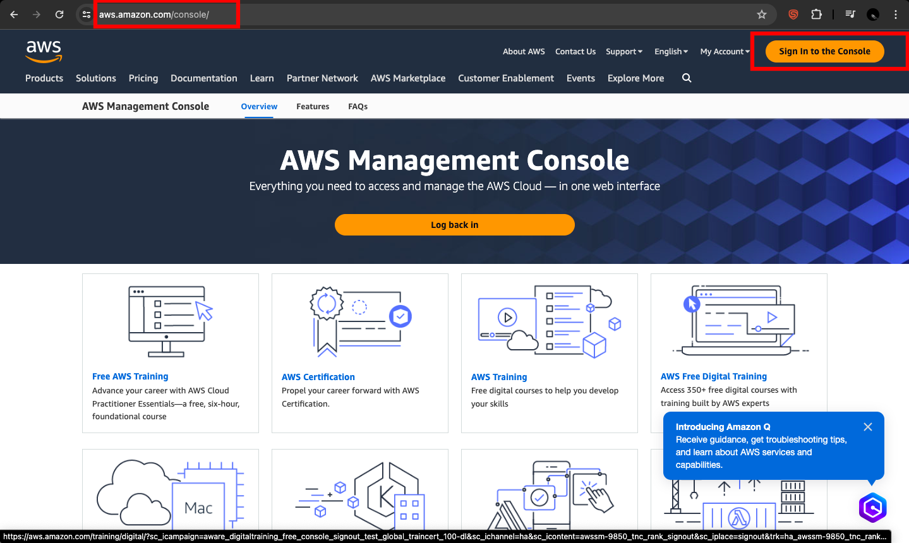
2. Sign in with your AWS account credentials.
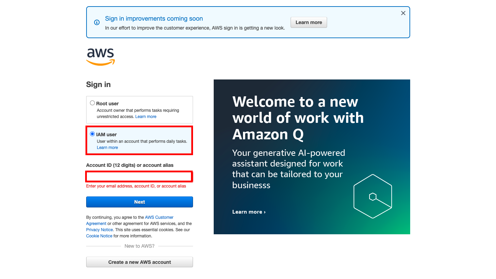

### Step 2: Navigate to IAM
1. In the AWS Management Console, in the top left corner, select the **Services** menu.
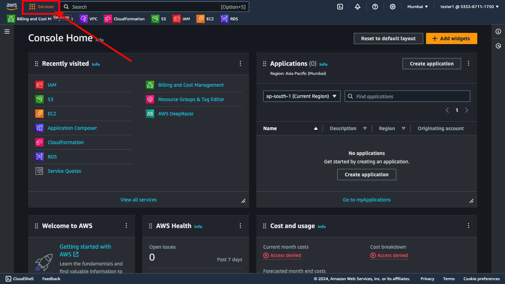
2. Under **Security, Identity, & Compliance**, select **IAM**. Alternatively, you can search for "IAM" as well.
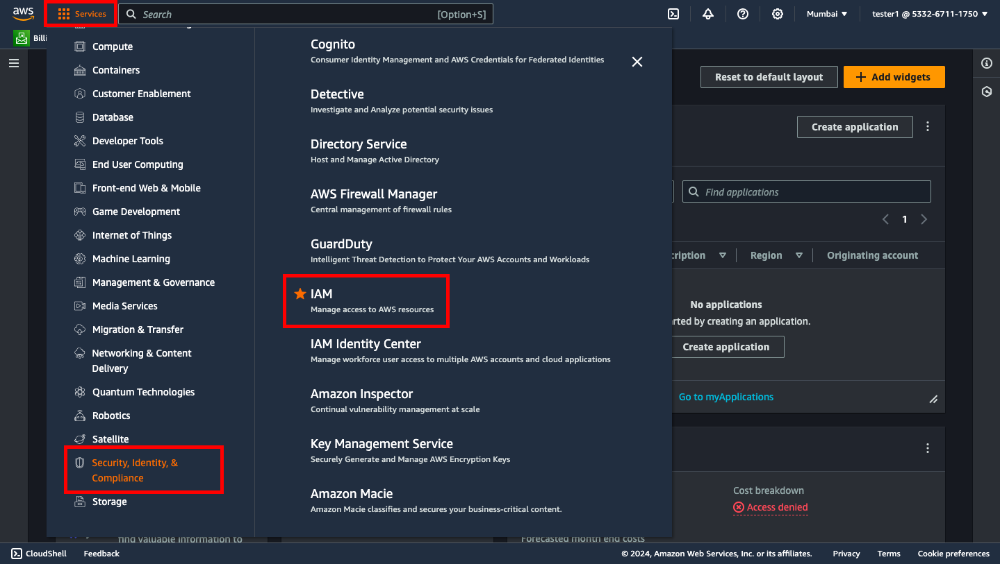
### Step 3: Create a New Policy
1. In the IAM dashboard, on the left-hand side, select **Policies**.
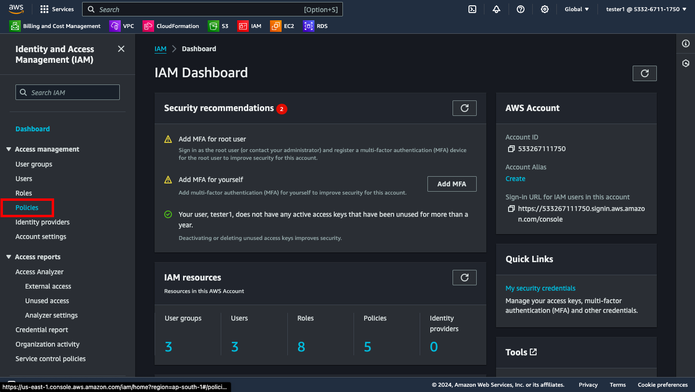
2. Click the **Create policy** button.
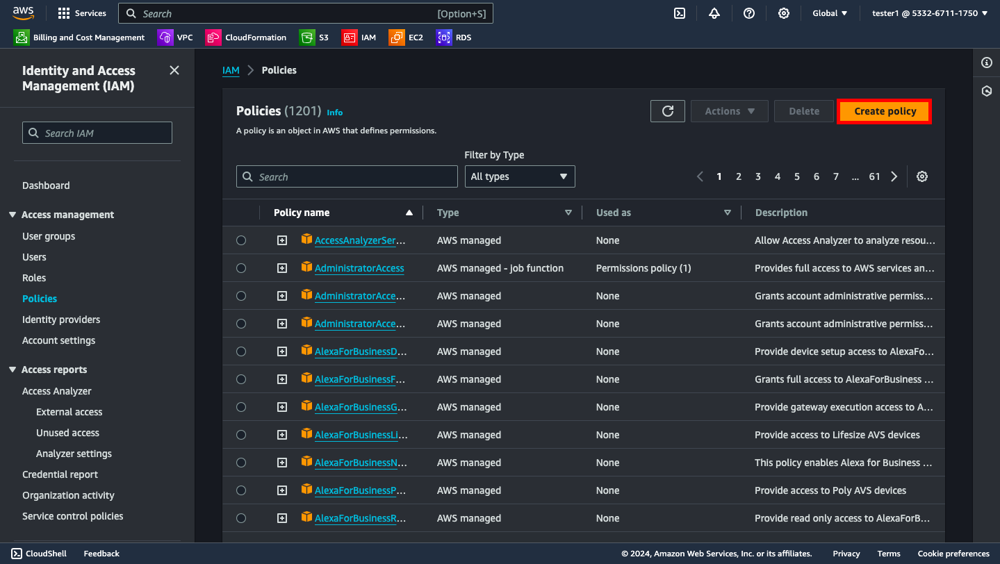

### Step 4: Define Permissions
1. **Visual Editor Tab**:
    - In the **Service** field, start typing the name of the AWS service you want to grant permissions for (e.g., `S3`) and select it.
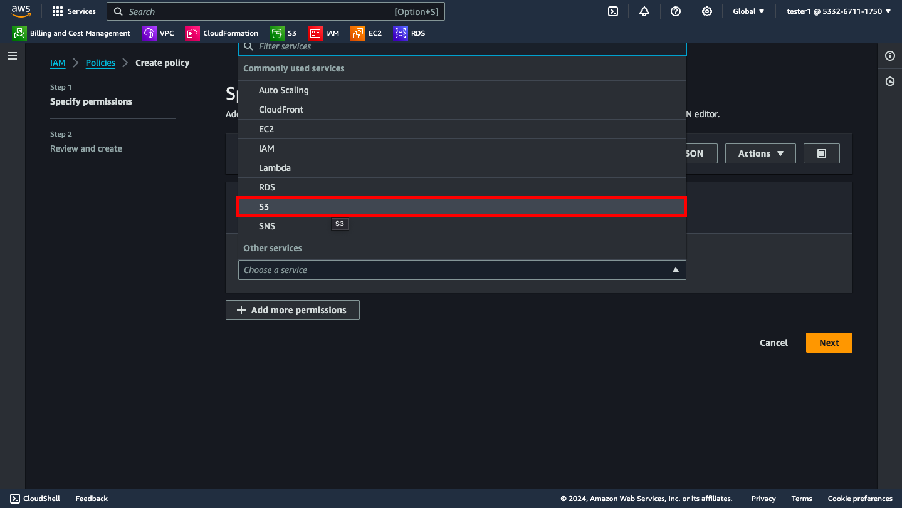
    - In the **Actions** field, choose the actions that will be allowed or denied (e.g., `All read actions`).
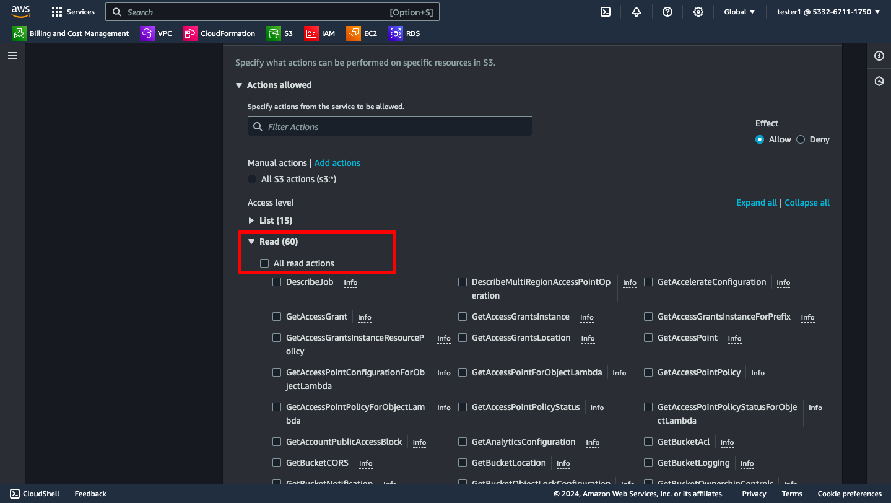
    - In the **Resources** field, specify the resources this policy will apply to (e.g., specific bucket ARN `All`).
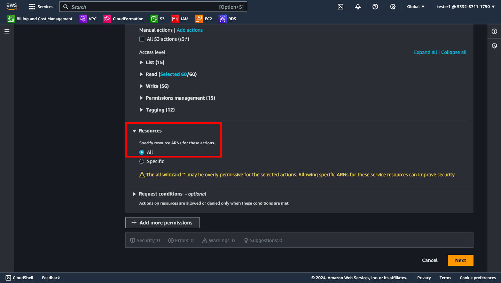

2. **JSON Tab** (optional):
    - Click on the **JSON** tab if you prefer to define the policy using JSON syntax.
    - Example JSON:
    ```json
    {
      "Version": "2012-10-17",
      "Statement": [ //contains the effect and actions that needs to be specified for the policy
        {
          "Effect": "Allow", //states the overall effect on the specified resources(allow or deny)
          "Action": [ //states the specific actions of the service
            "s3:ListBucket",
            "s3:GetObject"
          ],
          "Resource": [ //here we specify the resources that will be affected by the actions
            "arn:aws:s3:::example-bucket",
            "arn:aws:s3:::example-bucket/*"
          ]
        }
      ]
    }
    ```
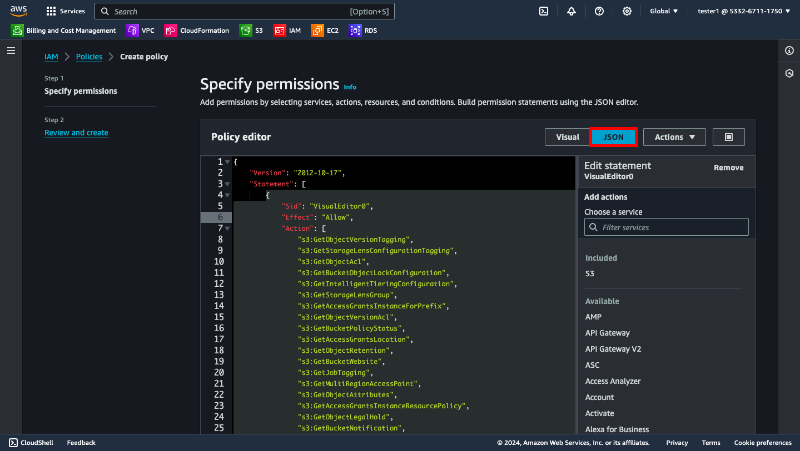

### Step 5: Review and Create
1. Click the **Next** button.
2. Provide a **Name** and an optional **Description** for the policy.
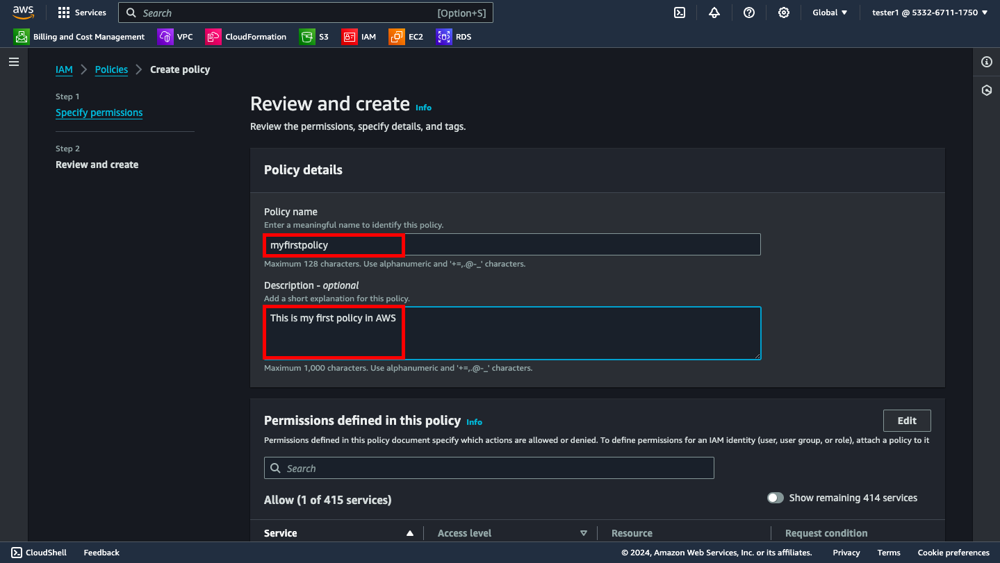
3. Review the policy summary to ensure everything is correct.
4. Click **Create policy** to save the new policy.
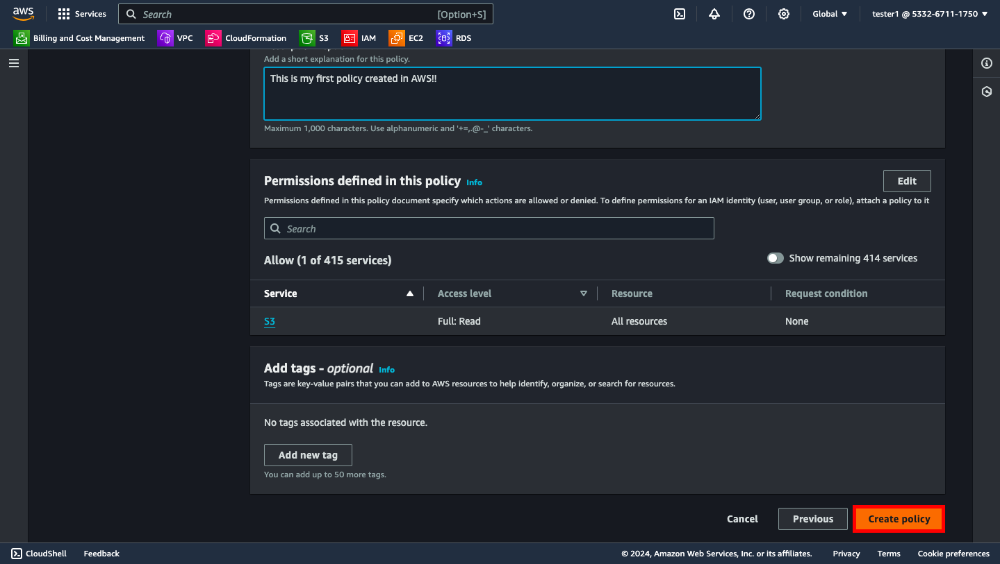
5. Congrats! You have succesfully created your first policy!
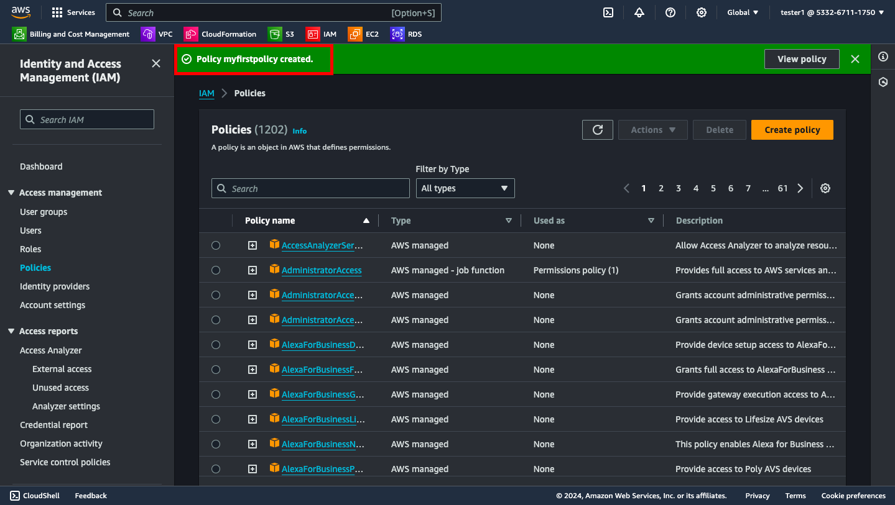
## Conclusion
You have successfully created an AWS IAM policy! IAM policies help manage permissions securely and efficiently in your AWS environment.

For further information, refer to the [AWS IAM User Guide](https://docs.aws.amazon.com/IAM/latest/UserGuide/introduction.html).
